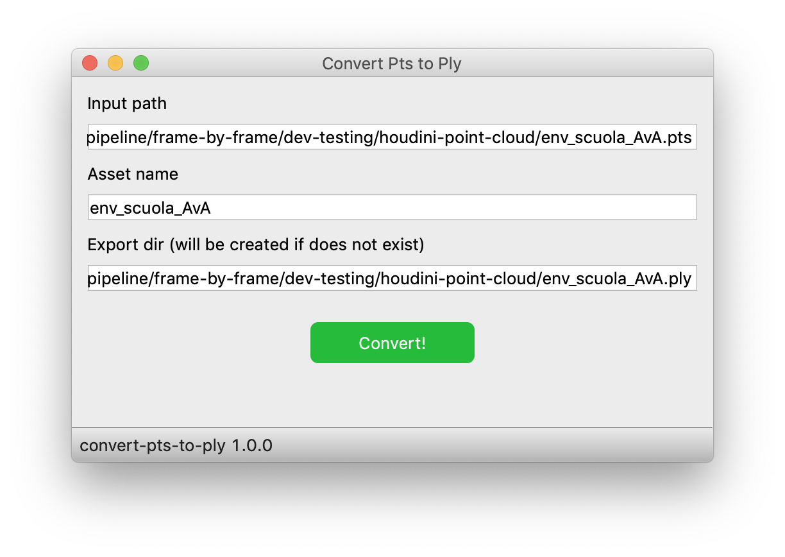

# Readme

This small gui app is used to convert `.pts` files (result of lidar point clouds) to the `.ply` format.

It was tested under macOS 10.9+ and Windows 10.

Probably works also under Linux (you may have to change a thing or two about the paths stuff).

## Requirements

`PySide2`. I would recommend using [conda ](https://conda.io/en/latest/miniconda.html) to manage your python envs and packages.

Through conda, pyside2 can be easily installed like this:

```
# Add the channel where pyside2 is available
conda config --add channels conda-forge

# Install PySide2 package
conda install pyside2

```

Check [this article](https://fredrikaverpil.github.io/2017/08/28/pyside2-easy-install/) by Fredrik Averpil to know more.

If you want to build the app, you'll also need `pyinstaller`.

```
pip install pyinstaller
```

Version numbers are specified in the `requirements.txt` file.

## Build

Under macOS and Linux, open a terminal and type `sh build.sh` file.

On Windows, use git bash to run `sh build.sh`.

## Screenshot (macOS)

